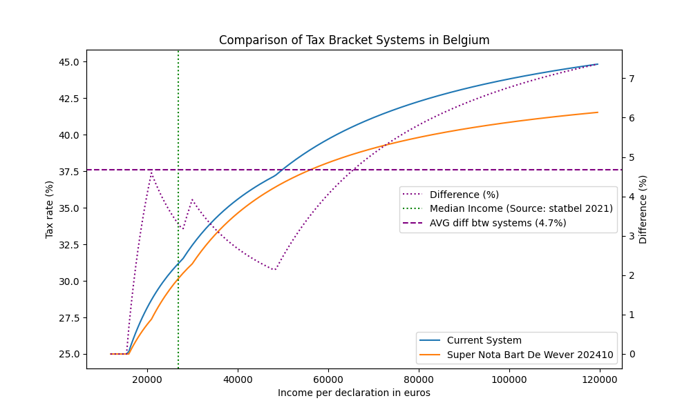

# Tax Brackets Belgium

This repository contains experimentations based on [this article](https://www.lecho.be/economie-politique/belgique/federal/formation-du-gouvernement-federal-bart-de-wever-veut-supprimer-la-tranche-superieure-d-impots/10569767.html).

## imposition.py

`imposition.py` is a script that calculates the tax brackets for Belgium. It processes income data and applies the relevant tax rates to determine the tax owed. The script is designed to help understand the impact of proposed changes to the tax system.

## Results

